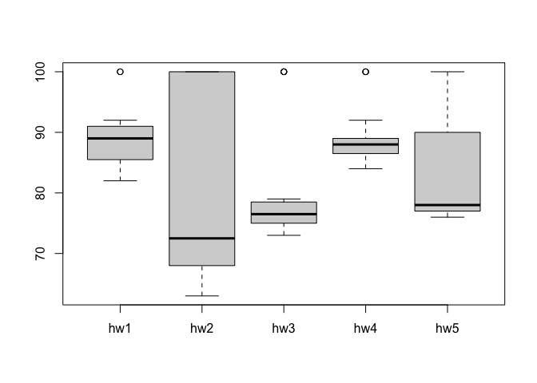

Class 6: R Functions
================
Sara Herrera (PID:A59011948)
10/15/2021

## Quick Rmarkdown intro

We can write text of course just like any file. We can **style text to
be bold** or *italic*.

Do:

-   this
-   and that
-   and another thing

THis is more text  
and this is a new line

------------------------------------------------------------------------

We can include some code:

``` r
plot(1:10)
```

<!-- -->

``` r
# This is a comment and will not be passed to R
# R function can be added with OPTION+Command+I
plot(cars)
```

<!-- -->

## Time to write a function

> **Q1**. Write a function grade() to determine an overall grade from a
> vector of student homework assignment scores dropping the lowest
> single score. If a student misses a homework (i.e. has an NA value)
> this can be used as a score to be potentially dropped. Your final
> function should be adquately explained with code comments and be able
> to work on an example class gradebook such as this one in CSV format:
> “<https://tinyurl.com/gradeinput>” \[3pts\]

``` r
# Example input vectors to start with
student1 <- c(100, 100, 100, 100, 100, 100, 100, 90)
student2 <- c(100, NA, 90, 90, 90, 90, 97, 80)
student3 <- c(90, NA, NA, NA, NA, NA, NA, NA)
```

First I want to find the lowest score. I can use the **min()** to find
it and the **which.min()** function to find where it is (i.e. its
position in the vector).

``` r
which.min(student1)
```

    ## [1] 8

I can use minus to get everything in the vector but the lowest score.

``` r
student1[ -which.min(student1) ]
```

    ## [1] 100 100 100 100 100 100 100

Now I can call the **mean()** function to get the average.

``` r
mean(student1[ -which.min(student1) ])
```

    ## [1] 100

Does this work for student2?

``` r
mean(student2[ -which.min(student2) ])
```

    ## [1] NA

NO! Why not?

``` r
student2
```

    ## [1] 100  NA  90  90  90  90  97  80

``` r
which.min(student2)
```

    ## [1] 8

``` r
mean(student2, na.rm=TRUE)
```

    ## [1] 91

``` r
student2
```

    ## [1] 100  NA  90  90  90  90  97  80

One great idea is to replace the NA values with zero.

Try this:

``` r
which(is.na(student2))
```

    ## [1] 2

This is.na() function returns a logical vector where TRUE elements
indicate the presence of NA values. (! marks in front will change the
TRUe to FALSE and viceversa)

``` r
is.na(student2)
```

    ## [1] FALSE  TRUE FALSE FALSE FALSE FALSE FALSE FALSE

Let’s replace NAs with zero

``` r
student.prime <- student2
student.prime[ is.na(student.prime)] = 0
student.prime
```

    ## [1] 100   0  90  90  90  90  97  80

Let’s add these bits to get our mean excluding the lowest score for
student2 (now student.prime)

``` r
student.prime <- student2
student.prime[ is.na(student.prime)] = 0
mean(student.prime[ -which.min(student.prime) ])
```

    ## [1] 91

How about student3?

``` r
student.prime <- student3
student.prime[ is.na(student.prime)] = 0
mean(student.prime[ -which.min(student.prime) ])
```

    ## [1] 12.85714

Let’s simplify and make it as clear as we can. We can make the object
names more simple

``` r
x <- student3
x[ is.na(x)] = 0
mean(x[ -which.min(x) ])
```

    ## [1] 12.85714

Before we continue, what happens if the numerics have a character value?
We can use the function as.numeri

``` r
student4 <- c(100, NA, 90, "90", 90, 90, 97, 80)
student4 (as.numeric("90"))
```

``` r
x <- student4
x <- as.numeric(x)
x[ is.na(x)] = 0
mean(x[ -which.min(x) ])
```

Finally, we’ll write our function. All functions have at least 3 things:
A name, input args and a body.

``` r
grade <- function(x) {
  x <- as.numeric(x)
  x[ is.na(x)] = 0
  mean(x[ -which.min(x) ])
}
```

And test if it works on a single vector

``` r
grade(student1)
```

    ## [1] 100

## Now grade a whole class

First we got to read the gradebook for the class.

``` r
gradebook <- "https://tinyurl.com/gradeinput"
scores <- read.csv(gradebook, row.names=1)
scores
```

    ##            hw1 hw2 hw3 hw4 hw5
    ## student-1  100  73 100  88  79
    ## student-2   85  64  78  89  78
    ## student-3   83  69  77 100  77
    ## student-4   88  NA  73 100  76
    ## student-5   88 100  75  86  79
    ## student-6   89  78 100  89  77
    ## student-7   89 100  74  87 100
    ## student-8   89 100  76  86 100
    ## student-9   86 100  77  88  77
    ## student-10  89  72  79  NA  76
    ## student-11  82  66  78  84 100
    ## student-12 100  70  75  92 100
    ## student-13  89 100  76 100  80
    ## student-14  85 100  77  89  76
    ## student-15  85  65  76  89  NA
    ## student-16  92 100  74  89  77
    ## student-17  88  63 100  86  78
    ## student-18  91  NA 100  87 100
    ## student-19  91  68  75  86  79
    ## student-20  91  68  76  88  76

We are going to use the super useful **apply()** function to grade all
the students with our **grade()** function. Some notes: “scores” are the
homework values; “1” is for getting the average or the function we
created per row, per student, “2” would be for columns; “grade” is the
function to apply.

``` r
ans <- apply(scores, 1, grade)
ans
```

    ##  student-1  student-2  student-3  student-4  student-5  student-6  student-7 
    ##      91.75      82.50      84.25      84.25      88.25      89.00      94.00 
    ##  student-8  student-9 student-10 student-11 student-12 student-13 student-14 
    ##      93.75      87.75      79.00      86.00      91.75      92.25      87.75 
    ## student-15 student-16 student-17 student-18 student-19 student-20 
    ##      78.75      89.50      88.00      94.50      82.75      82.75

> **Q2.** Using your grade() function and the supplied gradebook, Who is
> the top scoring student overall in the gradebook?

``` r
which.max(ans)
```

    ## student-18 
    ##         18

> **Q3.** From your analysis of the gradebook, which homework was
> toughest on students (i.e. obtained the lowest scores overall?

Here I will use **apply()** function again but this time looking at the
columns, which represent different homeworks. We’ll look at the mean of
the columns.

``` r
apply(scores, 2, mean)
```

    ##  hw1  hw2  hw3  hw4  hw5 
    ## 89.0   NA 80.8   NA   NA

Replace or mask NA values to zero. And then apply on our “masked”
scores.

``` r
mask <- scores
mask[ is.na(mask)] = 0
mask
```

    ##            hw1 hw2 hw3 hw4 hw5
    ## student-1  100  73 100  88  79
    ## student-2   85  64  78  89  78
    ## student-3   83  69  77 100  77
    ## student-4   88   0  73 100  76
    ## student-5   88 100  75  86  79
    ## student-6   89  78 100  89  77
    ## student-7   89 100  74  87 100
    ## student-8   89 100  76  86 100
    ## student-9   86 100  77  88  77
    ## student-10  89  72  79   0  76
    ## student-11  82  66  78  84 100
    ## student-12 100  70  75  92 100
    ## student-13  89 100  76 100  80
    ## student-14  85 100  77  89  76
    ## student-15  85  65  76  89   0
    ## student-16  92 100  74  89  77
    ## student-17  88  63 100  86  78
    ## student-18  91   0 100  87 100
    ## student-19  91  68  75  86  79
    ## student-20  91  68  76  88  76

``` r
apply(mask, 2, mean)
```

    ##   hw1   hw2   hw3   hw4   hw5 
    ## 89.00 72.80 80.80 85.15 79.25

> **Q4.** Optional Extension: From your analysis of the gradebook, which
> homework was most predictive of overall score (i.e. highest
> correlation with average grade score)?

Here we will use **cor()** function

``` r
cor(mask$hw1, ans)
```

    ## [1] 0.4250204

I can call the **cor()** for every homework and get a value for each,
but it’s best to do them all in one go using **apply()**

``` r
apply(mask, 2, cor, ans)
```

    ##       hw1       hw2       hw3       hw4       hw5 
    ## 0.4250204 0.1767780 0.3042561 0.3810884 0.6325982

Make a boxplot

``` r
boxplot(scores)
```

<!-- -->

``` r
grade2 <- function(x, drop.lowest=TRUE) {
  x <- as.numeric(x)
  x[ is.na(x)] = 0
  if(drop.lowest) {
    mean(x[ -which.min(x) ])
  } else {
    mean(x)
  }
}
```
