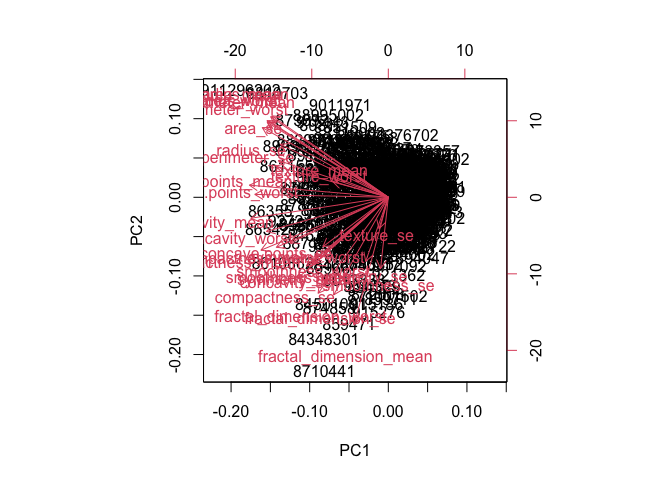
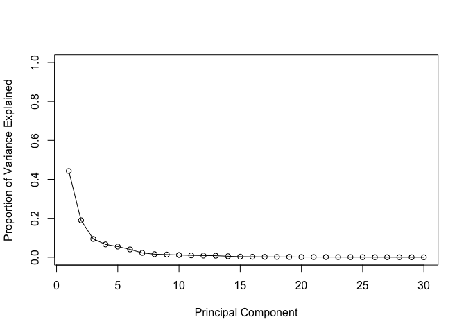

class09\_mini\_project.Rmd
================
Sara Herrera (PID:A59011948)
10/27/2021

``` r
# Save your input data file into your Project directory
fna.data <- "WisconsinCancer.csv"

# Complete the following code to input the data and store as wisc.df
wisc.df <- read.csv(fna.data, row.names=1)

# Examine the input data
#wisc.df

# We can use -1 here to remove the first column
wisc.data <- wisc.df[,-1]

# Create diagnosis vector for later 
diagnosis <- as.factor(wisc.df$diagnosis)
#diagnosis
```

> Q1. How many observations are in this dataset?

``` r
nrow(wisc.data)
```

    ## [1] 569

> Q2. How many of the observations have a malignant diagnosis?

``` r
table(diagnosis)
```

    ## diagnosis
    ##   B   M 
    ## 357 212

> Q3. How many variables/features in the data are suffixed with \_mean?

``` r
colnames(wisc.df)
```

    ##  [1] "diagnosis"               "radius_mean"            
    ##  [3] "texture_mean"            "perimeter_mean"         
    ##  [5] "area_mean"               "smoothness_mean"        
    ##  [7] "compactness_mean"        "concavity_mean"         
    ##  [9] "concave.points_mean"     "symmetry_mean"          
    ## [11] "fractal_dimension_mean"  "radius_se"              
    ## [13] "texture_se"              "perimeter_se"           
    ## [15] "area_se"                 "smoothness_se"          
    ## [17] "compactness_se"          "concavity_se"           
    ## [19] "concave.points_se"       "symmetry_se"            
    ## [21] "fractal_dimension_se"    "radius_worst"           
    ## [23] "texture_worst"           "perimeter_worst"        
    ## [25] "area_worst"              "smoothness_worst"       
    ## [27] "compactness_worst"       "concavity_worst"        
    ## [29] "concave.points_worst"    "symmetry_worst"         
    ## [31] "fractal_dimension_worst"

``` r
grep("_mean", colnames(wisc.df))
```

    ##  [1]  2  3  4  5  6  7  8  9 10 11

``` r
length(grep("_mean", colnames(wisc.df)))
```

    ## [1] 10

# Principal Component Analysis

``` r
# Check column means and standard deviations
colMeans(wisc.data)
```

    ##             radius_mean            texture_mean          perimeter_mean 
    ##            1.412729e+01            1.928965e+01            9.196903e+01 
    ##               area_mean         smoothness_mean        compactness_mean 
    ##            6.548891e+02            9.636028e-02            1.043410e-01 
    ##          concavity_mean     concave.points_mean           symmetry_mean 
    ##            8.879932e-02            4.891915e-02            1.811619e-01 
    ##  fractal_dimension_mean               radius_se              texture_se 
    ##            6.279761e-02            4.051721e-01            1.216853e+00 
    ##            perimeter_se                 area_se           smoothness_se 
    ##            2.866059e+00            4.033708e+01            7.040979e-03 
    ##          compactness_se            concavity_se       concave.points_se 
    ##            2.547814e-02            3.189372e-02            1.179614e-02 
    ##             symmetry_se    fractal_dimension_se            radius_worst 
    ##            2.054230e-02            3.794904e-03            1.626919e+01 
    ##           texture_worst         perimeter_worst              area_worst 
    ##            2.567722e+01            1.072612e+02            8.805831e+02 
    ##        smoothness_worst       compactness_worst         concavity_worst 
    ##            1.323686e-01            2.542650e-01            2.721885e-01 
    ##    concave.points_worst          symmetry_worst fractal_dimension_worst 
    ##            1.146062e-01            2.900756e-01            8.394582e-02

``` r
apply(wisc.data,2,sd)
```

    ##             radius_mean            texture_mean          perimeter_mean 
    ##            3.524049e+00            4.301036e+00            2.429898e+01 
    ##               area_mean         smoothness_mean        compactness_mean 
    ##            3.519141e+02            1.406413e-02            5.281276e-02 
    ##          concavity_mean     concave.points_mean           symmetry_mean 
    ##            7.971981e-02            3.880284e-02            2.741428e-02 
    ##  fractal_dimension_mean               radius_se              texture_se 
    ##            7.060363e-03            2.773127e-01            5.516484e-01 
    ##            perimeter_se                 area_se           smoothness_se 
    ##            2.021855e+00            4.549101e+01            3.002518e-03 
    ##          compactness_se            concavity_se       concave.points_se 
    ##            1.790818e-02            3.018606e-02            6.170285e-03 
    ##             symmetry_se    fractal_dimension_se            radius_worst 
    ##            8.266372e-03            2.646071e-03            4.833242e+00 
    ##           texture_worst         perimeter_worst              area_worst 
    ##            6.146258e+00            3.360254e+01            5.693570e+02 
    ##        smoothness_worst       compactness_worst         concavity_worst 
    ##            2.283243e-02            1.573365e-01            2.086243e-01 
    ##    concave.points_worst          symmetry_worst fractal_dimension_worst 
    ##            6.573234e-02            6.186747e-02            1.806127e-02

``` r
# Perform PCA on wisc.data by completing the following code
wisc.pr <- prcomp( wisc.data, scale=TRUE )
summary(wisc.pr)
```

    ## Importance of components:
    ##                           PC1    PC2     PC3     PC4     PC5     PC6     PC7
    ## Standard deviation     3.6444 2.3857 1.67867 1.40735 1.28403 1.09880 0.82172
    ## Proportion of Variance 0.4427 0.1897 0.09393 0.06602 0.05496 0.04025 0.02251
    ## Cumulative Proportion  0.4427 0.6324 0.72636 0.79239 0.84734 0.88759 0.91010
    ##                            PC8    PC9    PC10   PC11    PC12    PC13    PC14
    ## Standard deviation     0.69037 0.6457 0.59219 0.5421 0.51104 0.49128 0.39624
    ## Proportion of Variance 0.01589 0.0139 0.01169 0.0098 0.00871 0.00805 0.00523
    ## Cumulative Proportion  0.92598 0.9399 0.95157 0.9614 0.97007 0.97812 0.98335
    ##                           PC15    PC16    PC17    PC18    PC19    PC20   PC21
    ## Standard deviation     0.30681 0.28260 0.24372 0.22939 0.22244 0.17652 0.1731
    ## Proportion of Variance 0.00314 0.00266 0.00198 0.00175 0.00165 0.00104 0.0010
    ## Cumulative Proportion  0.98649 0.98915 0.99113 0.99288 0.99453 0.99557 0.9966
    ##                           PC22    PC23   PC24    PC25    PC26    PC27    PC28
    ## Standard deviation     0.16565 0.15602 0.1344 0.12442 0.09043 0.08307 0.03987
    ## Proportion of Variance 0.00091 0.00081 0.0006 0.00052 0.00027 0.00023 0.00005
    ## Cumulative Proportion  0.99749 0.99830 0.9989 0.99942 0.99969 0.99992 0.99997
    ##                           PC29    PC30
    ## Standard deviation     0.02736 0.01153
    ## Proportion of Variance 0.00002 0.00000
    ## Cumulative Proportion  1.00000 1.00000

> Q4. From your results, what proportion of the original variance is
> captured by the first principal components (PC1)?

**44.27%**

> Q5. How many principal components (PCs) are required to describe at
> least 70% of the original variance in the data?

**PC1, PC2, and PC3 (by looking at the cumulative proportion)**

> Q6. How many principal components (PCs) are required to describe at
> least 90% of the original variance in the data?

**7 PCs (PC1-PC7)**

# Interpretation of PCA results

``` r
biplot(wisc.pr)
```

<!-- -->

> Q7. What stands out to you about this plot? Is it easy or difficult to
> understand? Why?

**This plot is difficult to understand because there are too many
things.**

``` r
# Scatter plot observations by components 1 and 2, PC1 vs PC2
plot( wisc.pr$x , col = diagnosis , 
     xlab = "PC1", ylab = "PC2")
```

<!-- -->

``` r
# Can also use plot(wisc.pr$x[,1:2], col=diagnosis)
```

> Q8. Generate a similar plot for principal components 1 and 3. What do
> you notice about these plots?

**Component 2 explains more of the variance than component 3, but,
essentially, these plots are able to separate malignant (red) from
benign (black) samples.**

``` r
# Repeat for components 1 and 3
plot(wisc.pr$x[,c(1,3)], col = diagnosis, 
     xlab = "PC1", ylab = "PC3")
```

<!-- -->

``` r
# Create a data.frame for ggplot
df <- as.data.frame(wisc.pr$x)
df$diagnosis <- diagnosis

# Load the ggplot2 package
library(ggplot2)

# Make a scatter plot colored by diagnosis
ggplot(df) + 
  aes(PC1, PC2, col=diagnosis) + 
  geom_point()
```

<!-- -->

# Variance explained

``` r
# Calculate variance of each component
pr.var <- wisc.pr$sdev^2
head(pr.var)
```

    ## [1] 13.281608  5.691355  2.817949  1.980640  1.648731  1.207357

``` r
# Variance explained by each principal component: pve
pve <- pr.var / sum(pr.var)

# Plot variance explained for each principal component
plot(pve, xlab = "Principal Component", 
     ylab = "Proportion of Variance Explained", 
     ylim = c(0, 1), type = "o")
```

<!-- -->

``` r
# Alternative scree plot of the same data, note data driven y-axis
barplot(pve, ylab = "Precent of Variance Explained",
     names.arg=paste0("PC",1:length(pve)), las=2, axes = FALSE)
axis(2, at=pve, labels=round(pve,2)*100 )
```

<!-- -->

``` r
## ggplot based graph
#install.packages("factoextra")
library(factoextra)
```

    ## Welcome! Want to learn more? See two factoextra-related books at https://goo.gl/ve3WBa

``` r
fviz_eig(wisc.pr, addlabels = TRUE)
```

<!-- -->

> Q9. For the first principal component, what is the component of the
> loading vector (i.e. wisc.pr$rotation\[,1\]) for the feature
> concave.points\_mean?

``` r
wisc.pr$rotation[,1]
```

    ##             radius_mean            texture_mean          perimeter_mean 
    ##             -0.21890244             -0.10372458             -0.22753729 
    ##               area_mean         smoothness_mean        compactness_mean 
    ##             -0.22099499             -0.14258969             -0.23928535 
    ##          concavity_mean     concave.points_mean           symmetry_mean 
    ##             -0.25840048             -0.26085376             -0.13816696 
    ##  fractal_dimension_mean               radius_se              texture_se 
    ##             -0.06436335             -0.20597878             -0.01742803 
    ##            perimeter_se                 area_se           smoothness_se 
    ##             -0.21132592             -0.20286964             -0.01453145 
    ##          compactness_se            concavity_se       concave.points_se 
    ##             -0.17039345             -0.15358979             -0.18341740 
    ##             symmetry_se    fractal_dimension_se            radius_worst 
    ##             -0.04249842             -0.10256832             -0.22799663 
    ##           texture_worst         perimeter_worst              area_worst 
    ##             -0.10446933             -0.23663968             -0.22487053 
    ##        smoothness_worst       compactness_worst         concavity_worst 
    ##             -0.12795256             -0.21009588             -0.22876753 
    ##    concave.points_worst          symmetry_worst fractal_dimension_worst 
    ##             -0.25088597             -0.12290456             -0.13178394

**For the first principal component, the component of the loading vector
for the feature concave.points\_mean is -0.26085376.**

> Q10. What is the minimum number of principal components required to
> explain 80% of the variance of the data?

``` r
#summary(wisc.pr)
```

**The number of principal components required to explain 80% of the
variance is 5 (PC1-PC5).**

# Hierarchical clustering

``` r
# Scale the wisc.data data using the "scale()" function
data.scaled <- scale(wisc.data)

# Calculate the Euclidean distances
data.dist <- dist(data.scaled)

# Create hierarchical clustering
wisc.hclust <- hclust(data.dist, method="complete")
```

> Q11. Using the plot() and abline() functions, what is the height at
> which the clustering model has 4 clusters?

**Height at which the clustering model has 4 clusters is 19.**

``` r
plot(wisc.hclust)
abline(h=19, col="red", lty=2)
```

<!-- -->

# Selecting number of clusters

``` r
wisc.hclust.clusters <- cutree(wisc.hclust, k=4)
#wisc.hclust.clusters
```

``` r
table(wisc.hclust.clusters, diagnosis)
```

    ##                     diagnosis
    ## wisc.hclust.clusters   B   M
    ##                    1  12 165
    ##                    2   2   5
    ##                    3 343  40
    ##                    4   0   2

> Q12. Can you find a better cluster vs diagnoses match by cutting into
> a different number of clusters between 2 and 10?

``` r
wisc.hclust.clusters <- cutree(wisc.hclust, k=4)
table(wisc.hclust.clusters, diagnosis)
```

    ##                     diagnosis
    ## wisc.hclust.clusters   B   M
    ##                    1  12 165
    ##                    2   2   5
    ##                    3 343  40
    ##                    4   0   2

**I think cutting into 4 clusters gives a better cluster vs diagnoses
match because it’s the first time the 2 diagnoses split clearly between
malignant and benign.**

> Q13. Which method gives your favorite results for the same data.dist
> dataset? Explain your reasoning.

``` r
wisc.hclust1 <- hclust(data.dist, method="single")
wisc.hclust1
```

    ## 
    ## Call:
    ## hclust(d = data.dist, method = "single")
    ## 
    ## Cluster method   : single 
    ## Distance         : euclidean 
    ## Number of objects: 569

``` r
plot(wisc.hclust1)
```

<!-- -->

``` r
wisc.hclust1 <- hclust(data.dist, method="average")
wisc.hclust1
```

    ## 
    ## Call:
    ## hclust(d = data.dist, method = "average")
    ## 
    ## Cluster method   : average 
    ## Distance         : euclidean 
    ## Number of objects: 569

``` r
plot(wisc.hclust1)
```

<!-- -->

``` r
wisc.hclust1 <- hclust(data.dist, method="ward.D2")
wisc.hclust1
```

    ## 
    ## Call:
    ## hclust(d = data.dist, method = "ward.D2")
    ## 
    ## Cluster method   : ward.D2 
    ## Distance         : euclidean 
    ## Number of objects: 569

``` r
plot(wisc.hclust1)
```

<!-- -->

**The method that gives my favorite result is using method=“ward.D2”
because I can start to see the difference between the 2
diagnoses/clusters.**

# Clustering on PCA results

**I will use 7 PCs and `hclust()` and `dist()` as an input to describe
at least 90% of the variability in the data**

``` r
wisc.pr.hclust <- hclust( dist(wisc.pr$x[,1:7]), method="ward.D2")
```

``` r
plot(wisc.pr.hclust)
abline(h=80, col="red")
```

<!-- -->

**Let’s find our cluster membership vector by cutting this tree into k=2
groups.**

``` r
grps <- cutree(wisc.pr.hclust, k=2)
table(grps)
```

    ## grps
    ##   1   2 
    ## 216 353

**We can do a cross-table to see how many B’s or M’s are in each
group/cluster**

``` r
table(grps, diagnosis)
```

    ##     diagnosis
    ## grps   B   M
    ##    1  28 188
    ##    2 329  24

**With this plot we can differentiate True Negative = 329, True Positive
= 188, False Positive = 28, and False Negative = 24** **“Accuracy”,
essentially how many did we get correct:**

``` r
(188+329) / nrow(wisc.data)
```

    ## [1] 0.9086116

**“Sensitivity”, the true ill we got correct:**

``` r
(188 / (188 + 24))
```

    ## [1] 0.8867925

**“Specificity”:**

``` r
(329 / (329+24))
```

    ## [1] 0.9320113

# 7. Prediction

``` r
#url <- "new_samples.csv"
url <- "https://tinyurl.com/new-samples-CSV"
new <- read.csv(url)
npc <- predict(wisc.pr, newdata=new)
#npc
```

**Now add these new samples to our PCA plot**

``` r
plot(wisc.pr$x[,1:2], col=diagnosis)
points(npc[,1], npc[,2], col="blue", pch=16, cex=3)
text(npc[,1], npc[,2], labels=c(1,2), col="white")
```

<!-- -->
