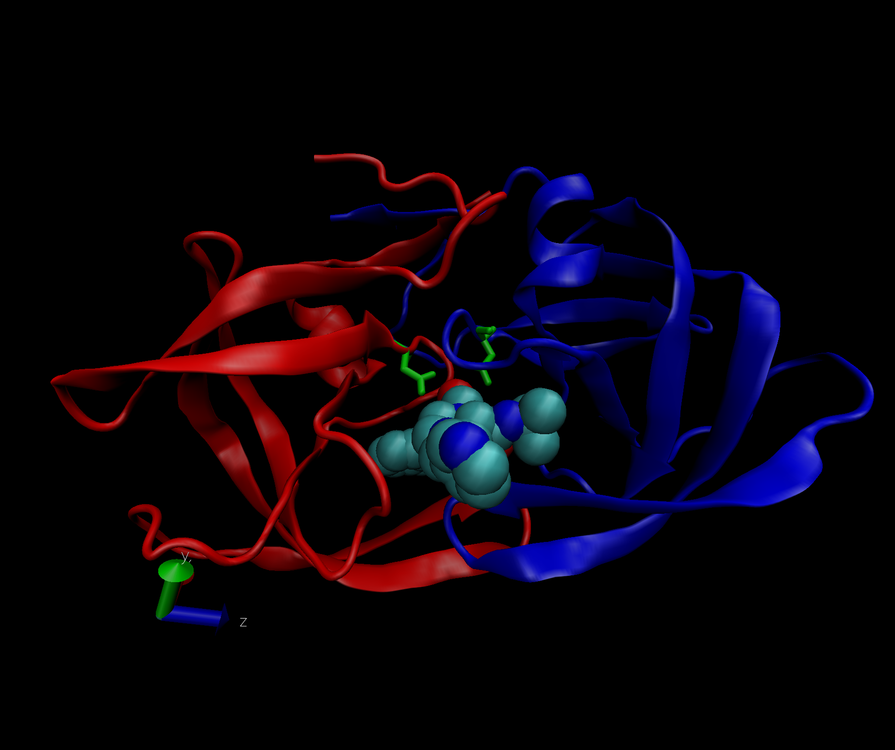

class11.Rmd
================

# 1: Introduction to the RCSB Protein Data Bank (PDB)

PDB Statistics

**Overview of the data**

``` r
data <- read.csv("Data_Export_Summary.csv", row.names = 1)
```

> Q1: What percentage of structures in the PDB are solved by X-Ray and
> Electron Microscopy.

**X-ray 87.53% and EM 4.95%**

``` r
round((sum(data$"X.ray") / sum(data$"Total")) * 100, 2)
```

    ## [1] 87.53

``` r
round((sum(data$"EM") / sum(data$"Total")) * 100, 2)
```

    ## [1] 4.95

**For every column:**

``` r
round((colSums(data) / sum(data$Total)) * 100, 2)
```

    ##            X.ray              NMR               EM Multiple.methods 
    ##            87.53             7.36             4.95             0.11 
    ##          Neutron            Other            Total 
    ##             0.04             0.02           100.00

> Q2: What proportion of structures in the PDB are protein?

**87.4%**

``` r
# To extract the column and select that value in the row:
data$Total[1]
```

    ## [1] 160543

``` r
round((data$Total[1] / sum(data$Total)) * 100, 2)
```

    ## [1] 87.35

> Q3: Type HIV in the PDB website search box on the home page and
> determine how many HIV-1 protease structures are in the current PDB?

**23409**

> Q4: Water molecules normally have 3 atoms. Why do we see just one atom
> per water molecule in this structure?

**We don’t see the hydrogen atoms, only the oxygen one, because the
resolution is 1.9 Armstrong**

> Q5: There is a conserved water molecule in the binding site. Can you
> identify this water molecule? What residue number does this water
> molecule have?

**HOH308:0**



# 3. Introduction to Bio3D in R

**Using Bio3D in R for structure bioinformatics**

``` r
library(bio3d)

pdb <- read.pdb("1hel")
```

    ##   Note: Accessing on-line PDB file

``` r
pdb
```

    ## 
    ##  Call:  read.pdb(file = "1hel")
    ## 
    ##    Total Models#: 1
    ##      Total Atoms#: 1186,  XYZs#: 3558  Chains#: 1  (values: A)
    ## 
    ##      Protein Atoms#: 1001  (residues/Calpha atoms#: 129)
    ##      Nucleic acid Atoms#: 0  (residues/phosphate atoms#: 0)
    ## 
    ##      Non-protein/nucleic Atoms#: 185  (residues: 185)
    ##      Non-protein/nucleic resid values: [ HOH (185) ]
    ## 
    ##    Protein sequence:
    ##       KVFGRCELAAAMKRHGLDNYRGYSLGNWVCAAKFESNFNTQATNRNTDGSTDYGILQINS
    ##       RWWCNDGRTPGSRNLCNIPCSALLSSDITASVNCAKKIVSDGNGMNAWVAWRNRCKGTDV
    ##       QAWIRGCRL
    ## 
    ## + attr: atom, xyz, seqres, helix, sheet,
    ##         calpha, remark, call

``` r
head(pdb$atom)
```

    ##   type eleno elety  alt resid chain resno insert      x      y      z o     b
    ## 1 ATOM     1     N <NA>   LYS     A     1   <NA>  3.294 10.164 10.266 1 11.18
    ## 2 ATOM     2    CA <NA>   LYS     A     1   <NA>  2.388 10.533  9.168 1  9.68
    ## 3 ATOM     3     C <NA>   LYS     A     1   <NA>  2.438 12.049  8.889 1 14.00
    ## 4 ATOM     4     O <NA>   LYS     A     1   <NA>  2.406 12.898  9.815 1 14.00
    ## 5 ATOM     5    CB <NA>   LYS     A     1   <NA>  0.949 10.101  9.559 1 13.29
    ## 6 ATOM     6    CG <NA>   LYS     A     1   <NA> -0.050 10.621  8.573 1 13.52
    ##   segid elesy charge
    ## 1  <NA>     N   <NA>
    ## 2  <NA>     C   <NA>
    ## 3  <NA>     C   <NA>
    ## 4  <NA>     O   <NA>
    ## 5  <NA>     C   <NA>
    ## 6  <NA>     C   <NA>

``` r
# Normal mode analysis (nma)
# Do a Normal Mode Analysis (NMA): a prediction of the conformational variability and intrinsic dynamics of this protein.
m <- nma(pdb)
```

    ##  Building Hessian...     Done in 0.016 seconds.
    ##  Diagonalizing Hessian...    Done in 0.095 seconds.

``` r
plot(m)
```

<!-- -->

``` r
# Make a little movie (trajectory) for viewing in VMD
mktrj(m, file="nma.pdb")
```
