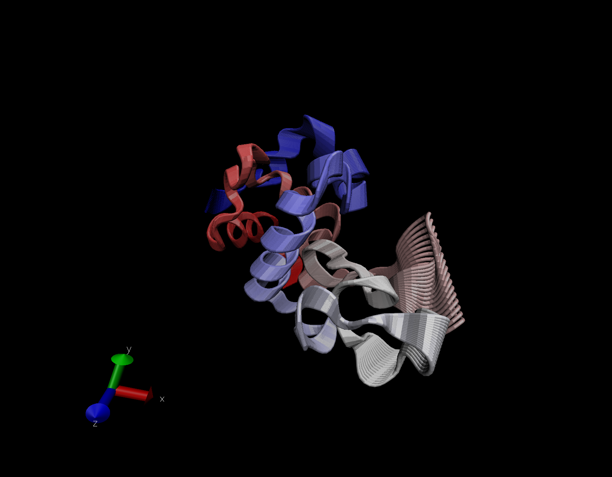
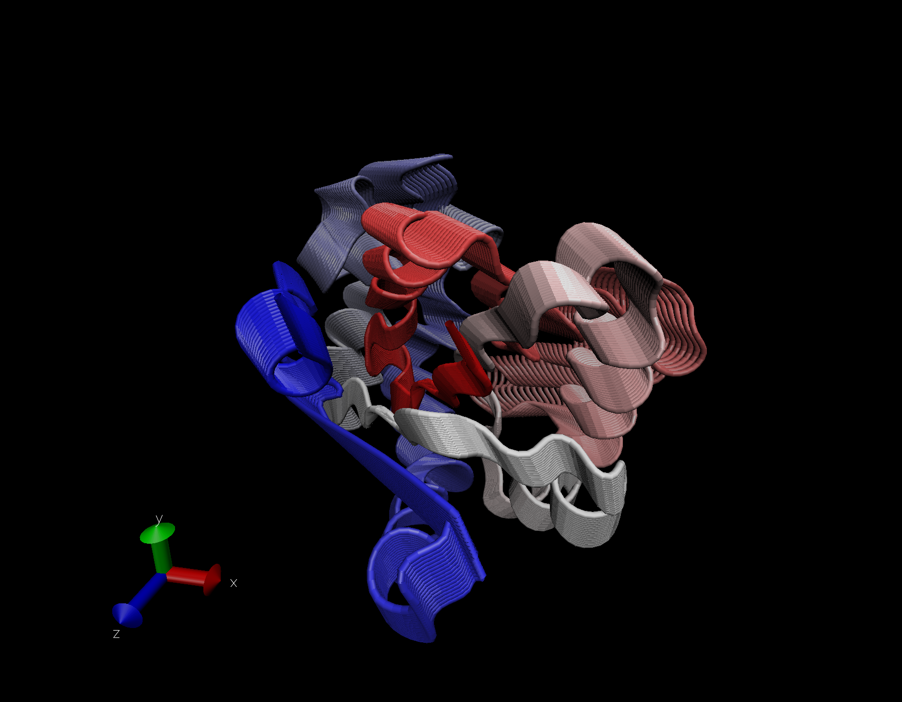
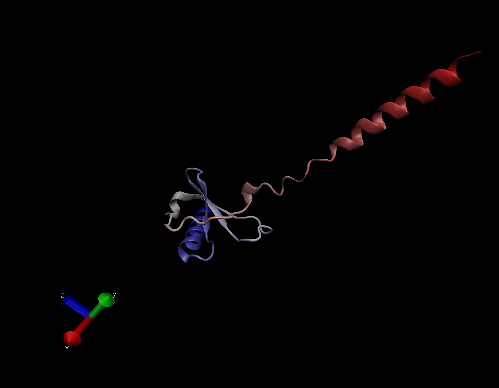

# Working with bio3d

```{r}
library(bio3d)
pdb <- read.pdb("1hel")
pdb
```
```{r}
head(pdb$atom)
```

**Let's do a quick bioinformatics prediction of protein dynamics (flexibility). We'll use the 'nma()' function, which does Normal Mode Analysis**

```{r}
modes <- nma(pdb)
plot(modes)
```

**Make a trajectory of this prediction with 'mktrj()'.**

```{r}
mktrj(modes, file='nma.pdb')
```

**And the image from VMD**




## 4. Comparative Structure Analysis

**Start by getting a sequence of interest**

```{r}
aa <- get.seq("1ake_A")
aa
```
**I want to search the PDB database (the main db for exp structures) for sequences like my aa sequence**

```{r}
blast <- blast.pdb(aa)
```

```{r}
hits <- plot(blast)
```

**Now I have my top hits from the search of the PDB (structures in the db more like mine).**

```{r}
hits$pdb.id
```

**Here we download all these similar structures in the PDB and store them on our computer.**

```{r}
# Download releated PDB files
# If we open this directly on VMD it'll show all the structures as they are, not overlapped or aligned

files <- get.pdb(hits$pdb.id, path="pdbs", split=TRUE, gzip=TRUE)
```

**Now we want to align all these structures... We'll use the function 'pdbaln()'**

```{r}
# Takes the files as input and then aligns related PDBs
pdbs <- pdbaln(files, fit = TRUE)#, exefile="msa")
```

**Let's have a look:**
```{r}
pdbs
```

```{r}
# Vector containing PDB codes for figure axis
ids <- basename.pdb(pdbs$id)

# Draw schematic alignment. The aa gaps are shown as white spaces.
plot(pdbs, labels=ids)
```

```{r}
pdbs$xyz
```

## Pincipal Component Analysis

**Here we will do PCA on the xyz coordinates data of all these structures with the 'pca()' function in bio3d**

```{r}
pc <- pca(pdbs)
plot(pc)
```

**Let's visualize the displacements/movements of the structure that are captured by PC1**

```{r}
mktrj(pc,pc=1, file="pca.pdb")
```



**My protein:**




