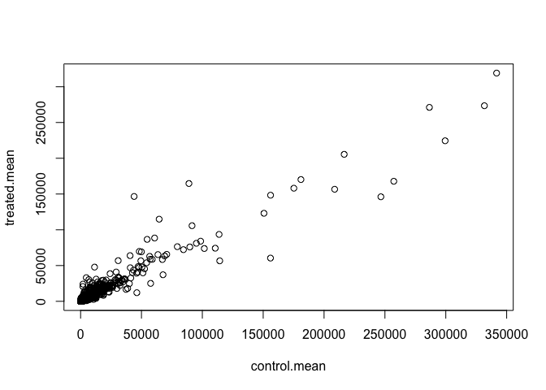
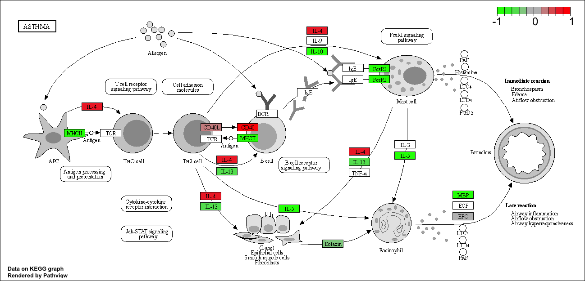

class15.Rmd
================
Sara Herrera (PID:A59011948)
11/17/2021

# 1. Bioconductor and DESeq2 setup

Today we look at data from a published RNA-seq experiment where airway
smooth muscle cells were treated with dexamethasone, a synthetic
glucocorticoid steroid with anti-inflammatory effects (Himes et
al. 2014).

``` r
# library(DESeq2)
```

# 2. Load the contData and colData

We need 2 things - 1: count data - 2: colData (the metadata that tells
us about the design of the experiment)

``` r
counts <- read.csv("airway_scaledcounts.csv", row.names=1)
metadata <-  read.csv("airway_metadata.csv")
```

``` r
head(counts)
```

    ##                 SRR1039508 SRR1039509 SRR1039512 SRR1039513 SRR1039516
    ## ENSG00000000003        723        486        904        445       1170
    ## ENSG00000000005          0          0          0          0          0
    ## ENSG00000000419        467        523        616        371        582
    ## ENSG00000000457        347        258        364        237        318
    ## ENSG00000000460         96         81         73         66        118
    ## ENSG00000000938          0          0          1          0          2
    ##                 SRR1039517 SRR1039520 SRR1039521
    ## ENSG00000000003       1097        806        604
    ## ENSG00000000005          0          0          0
    ## ENSG00000000419        781        417        509
    ## ENSG00000000457        447        330        324
    ## ENSG00000000460         94        102         74
    ## ENSG00000000938          0          0          0

``` r
head(metadata)
```

    ##           id     dex celltype     geo_id
    ## 1 SRR1039508 control   N61311 GSM1275862
    ## 2 SRR1039509 treated   N61311 GSM1275863
    ## 3 SRR1039512 control  N052611 GSM1275866
    ## 4 SRR1039513 treated  N052611 GSM1275867
    ## 5 SRR1039516 control  N080611 GSM1275870
    ## 6 SRR1039517 treated  N080611 GSM1275871

Side note: Let’s check the correspondence of the metadata and count data
setup.

``` r
metadata$id
```

    ## [1] "SRR1039508" "SRR1039509" "SRR1039512" "SRR1039513" "SRR1039516"
    ## [6] "SRR1039517" "SRR1039520" "SRR1039521"

``` r
colnames(counts)
```

    ## [1] "SRR1039508" "SRR1039509" "SRR1039512" "SRR1039513" "SRR1039516"
    ## [6] "SRR1039517" "SRR1039520" "SRR1039521"

We can use the ‘==’ to see if they are the same:

``` r
all(metadata$id == colnames(counts))
```

    ## [1] TRUE

# Differential Gene Expression: Compare control to treated

First we need to access all the ‘control’ columns in our counts data

``` r
control.inds <- metadata$dex == "control"
metadata[ control.inds, ]
```

    ##           id     dex celltype     geo_id
    ## 1 SRR1039508 control   N61311 GSM1275862
    ## 3 SRR1039512 control  N052611 GSM1275866
    ## 5 SRR1039516 control  N080611 GSM1275870
    ## 7 SRR1039520 control  N061011 GSM1275874

``` r
# This will only print out in the metadata whatever is control
# Or which(control.ids == TRUE)
# To just get the control IDs:
control.ids <- metadata[ control.inds, ]$id
```

Use these IDs to access just the control columns of our ‘counts’ data

``` r
head(counts[ ,control.ids])
```

    ##                 SRR1039508 SRR1039512 SRR1039516 SRR1039520
    ## ENSG00000000003        723        904       1170        806
    ## ENSG00000000005          0          0          0          0
    ## ENSG00000000419        467        616        582        417
    ## ENSG00000000457        347        364        318        330
    ## ENSG00000000460         96         73        118        102
    ## ENSG00000000938          0          1          2          0

``` r
# To calculate the mean of expression for each gene in the control condition:
control.mean <- rowMeans(counts[ ,control.ids])
head(control.mean)
```

    ## ENSG00000000003 ENSG00000000005 ENSG00000000419 ENSG00000000457 ENSG00000000460 
    ##          900.75            0.00          520.50          339.75           97.25 
    ## ENSG00000000938 
    ##            0.75

Now we do the same for the treated:

``` r
treated.inds <- metadata$dex == "treated"
metadata[ treated.inds, ]
```

    ##           id     dex celltype     geo_id
    ## 2 SRR1039509 treated   N61311 GSM1275863
    ## 4 SRR1039513 treated  N052611 GSM1275867
    ## 6 SRR1039517 treated  N080611 GSM1275871
    ## 8 SRR1039521 treated  N061011 GSM1275875

``` r
# This will only print out in the metadata whatever is treated
# Or which(treated.ids == TRUE)
# To just get the treated IDs:
treated.ids <- metadata[ treated.inds, ]$id
```

``` r
# To calculate the mean of expression for each gene in the treated condition:
treated.mean <- rowMeans(counts[ ,treated.ids])
head(treated.mean)
```

    ## ENSG00000000003 ENSG00000000005 ENSG00000000419 ENSG00000000457 ENSG00000000460 
    ##          658.00            0.00          546.00          316.50           78.75 
    ## ENSG00000000938 
    ##            0.00

> Q. Number of genes?

There are 38694 rows/genes in this dataset

``` r
nrow(counts)
```

    ## [1] 38694

We will combine our meancount data for bookkeeping purposes

``` r
meancounts <- data.frame(control.mean, treated.mean)
colSums(meancounts)
```

    ## control.mean treated.mean 
    ##     23005324     22196524

## Compare the control and the treated

A quick plot of our progress so far

``` r
plot(meancounts)
```

<!-- -->

This suggests that we need to perform a log transformation. Let’s plot
on a log scale.

``` r
plot(meancounts, log="xy")
```

    ## Warning in xy.coords(x, y, xlabel, ylabel, log): 15032 x values <= 0 omitted
    ## from logarithmic plot

    ## Warning in xy.coords(x, y, xlabel, ylabel, log): 15281 y values <= 0 omitted
    ## from logarithmic plot

<!-- -->

We often use log transformation (log2) as they make life much easier…
Examples:

``` r
log2(20/20)
```

    ## [1] 0

``` r
log2(10/20)
```

    ## [1] -1

``` r
log2(80/20)
```

    ## [1] 2

``` r
# The meancounts table has 2 columns: control.mean and treated.mean, and we're going to add a third column to this table, log2fc
meancounts$log2fc <- log2(meancounts[,"treated.mean"]/meancounts[,"control.mean"])
head(meancounts)
```

    ##                 control.mean treated.mean      log2fc
    ## ENSG00000000003       900.75       658.00 -0.45303916
    ## ENSG00000000005         0.00         0.00         NaN
    ## ENSG00000000419       520.50       546.00  0.06900279
    ## ENSG00000000457       339.75       316.50 -0.10226805
    ## ENSG00000000460        97.25        78.75 -0.30441833
    ## ENSG00000000938         0.75         0.00        -Inf

We need to drop the zeros and invalid lines!

``` r
head(meancounts[,1:2] == 0)
```

    ##                 control.mean treated.mean
    ## ENSG00000000003        FALSE        FALSE
    ## ENSG00000000005         TRUE         TRUE
    ## ENSG00000000419        FALSE        FALSE
    ## ENSG00000000457        FALSE        FALSE
    ## ENSG00000000460        FALSE        FALSE
    ## ENSG00000000938        FALSE         TRUE

The `which()` function tells us the indices of TRUE entries in a logical
vector. Example:

``` r
which(c(T,F,T))
```

    ## [1] 1 3

However, it’s not that useful in default mode on our type of multi
column input…

``` r
# arr.ind will tell me the column and row position with 0's in it
inds <- which(meancounts[,1:2] == 0, arr.ind=TRUE)
head(inds)
```

    ##                 row col
    ## ENSG00000000005   2   1
    ## ENSG00000004848  65   1
    ## ENSG00000004948  70   1
    ## ENSG00000005001  73   1
    ## ENSG00000006059 121   1
    ## ENSG00000006071 123   1

I only care about the rows here (if there’s a 0 in any column I will
exclude this row eventually).

``` r
to.rm <- unique(sort(inds[,"row"]))
```

``` r
# To check, this command will show all the rows that have 0's to check with the id
head(meancounts[to.rm,])
```

    ##                 control.mean treated.mean log2fc
    ## ENSG00000000005         0.00         0.00    NaN
    ## ENSG00000000938         0.75         0.00   -Inf
    ## ENSG00000004848         0.00         0.25    Inf
    ## ENSG00000004948         0.00         0.00    NaN
    ## ENSG00000005001         0.00         0.00    NaN
    ## ENSG00000005102         1.00         0.00   -Inf

``` r
# To check the genes that we actually want to work with:
mycounts <- meancounts[-to.rm,]
head(meancounts[-to.rm,])
```

    ##                 control.mean treated.mean      log2fc
    ## ENSG00000000003       900.75       658.00 -0.45303916
    ## ENSG00000000419       520.50       546.00  0.06900279
    ## ENSG00000000457       339.75       316.50 -0.10226805
    ## ENSG00000000460        97.25        78.75 -0.30441833
    ## ENSG00000000971      5219.00      6687.50  0.35769358
    ## ENSG00000001036      2327.00      1785.75 -0.38194109

We now have 21817 genes remaining.

``` r
nrow(mycounts)
```

    ## [1] 21817

How many of these genes are up regulated at the log2 fold-change
threshold of +2 or greater?

``` r
sum(mycounts$log2fc > 2)
```

    ## [1] 250

What % is that?

``` r
round((sum(mycounts$log2fc > 2) / nrow(mycounts)) * 100, 2)
```

    ## [1] 1.15

How many of these genes are down regulated at the log2 fold-change
threshold of -2 or smaller?

``` r
sum(mycounts$log2fc < (-2))
```

    ## [1] 367

``` r
round((sum(mycounts$log2fc < (-2)) / nrow(mycounts)) * 100, 2)
```

    ## [1] 1.68

# DESeq 2 analysis

``` r
library(DESeq2)
```

    ## Loading required package: S4Vectors

    ## Loading required package: stats4

    ## Loading required package: BiocGenerics

    ## 
    ## Attaching package: 'BiocGenerics'

    ## The following objects are masked from 'package:stats':
    ## 
    ##     IQR, mad, sd, var, xtabs

    ## The following objects are masked from 'package:base':
    ## 
    ##     anyDuplicated, append, as.data.frame, basename, cbind, colnames,
    ##     dirname, do.call, duplicated, eval, evalq, Filter, Find, get, grep,
    ##     grepl, intersect, is.unsorted, lapply, Map, mapply, match, mget,
    ##     order, paste, pmax, pmax.int, pmin, pmin.int, Position, rank,
    ##     rbind, Reduce, rownames, sapply, setdiff, sort, table, tapply,
    ##     union, unique, unsplit, which.max, which.min

    ## 
    ## Attaching package: 'S4Vectors'

    ## The following objects are masked from 'package:base':
    ## 
    ##     expand.grid, I, unname

    ## Loading required package: IRanges

    ## Loading required package: GenomicRanges

    ## Loading required package: GenomeInfoDb

    ## Loading required package: SummarizedExperiment

    ## Loading required package: MatrixGenerics

    ## Loading required package: matrixStats

    ## 
    ## Attaching package: 'MatrixGenerics'

    ## The following objects are masked from 'package:matrixStats':
    ## 
    ##     colAlls, colAnyNAs, colAnys, colAvgsPerRowSet, colCollapse,
    ##     colCounts, colCummaxs, colCummins, colCumprods, colCumsums,
    ##     colDiffs, colIQRDiffs, colIQRs, colLogSumExps, colMadDiffs,
    ##     colMads, colMaxs, colMeans2, colMedians, colMins, colOrderStats,
    ##     colProds, colQuantiles, colRanges, colRanks, colSdDiffs, colSds,
    ##     colSums2, colTabulates, colVarDiffs, colVars, colWeightedMads,
    ##     colWeightedMeans, colWeightedMedians, colWeightedSds,
    ##     colWeightedVars, rowAlls, rowAnyNAs, rowAnys, rowAvgsPerColSet,
    ##     rowCollapse, rowCounts, rowCummaxs, rowCummins, rowCumprods,
    ##     rowCumsums, rowDiffs, rowIQRDiffs, rowIQRs, rowLogSumExps,
    ##     rowMadDiffs, rowMads, rowMaxs, rowMeans2, rowMedians, rowMins,
    ##     rowOrderStats, rowProds, rowQuantiles, rowRanges, rowRanks,
    ##     rowSdDiffs, rowSds, rowSums2, rowTabulates, rowVarDiffs, rowVars,
    ##     rowWeightedMads, rowWeightedMeans, rowWeightedMedians,
    ##     rowWeightedSds, rowWeightedVars

    ## Loading required package: Biobase

    ## Welcome to Bioconductor
    ## 
    ##     Vignettes contain introductory material; view with
    ##     'browseVignettes()'. To cite Bioconductor, see
    ##     'citation("Biobase")', and for packages 'citation("pkgname")'.

    ## 
    ## Attaching package: 'Biobase'

    ## The following object is masked from 'package:MatrixGenerics':
    ## 
    ##     rowMedians

    ## The following objects are masked from 'package:matrixStats':
    ## 
    ##     anyMissing, rowMedians

We first need to setup the DESeq input object:

``` r
dds <- DESeqDataSetFromMatrix(countData=counts, 
                              colData=metadata, 
                              design=~dex)
```

    ## converting counts to integer mode

    ## Warning in DESeqDataSet(se, design = design, ignoreRank): some variables in
    ## design formula are characters, converting to factors

Run the DESeq analysis pipeline.

``` r
dds <- DESeq(dds)
```

    ## estimating size factors

    ## estimating dispersions

    ## gene-wise dispersion estimates

    ## mean-dispersion relationship

    ## final dispersion estimates

    ## fitting model and testing

``` r
res <- results(dds)
head(res)
```

    ## log2 fold change (MLE): dex treated vs control 
    ## Wald test p-value: dex treated vs control 
    ## DataFrame with 6 rows and 6 columns
    ##                   baseMean log2FoldChange     lfcSE      stat    pvalue
    ##                  <numeric>      <numeric> <numeric> <numeric> <numeric>
    ## ENSG00000000003 747.194195     -0.3507030  0.168246 -2.084470 0.0371175
    ## ENSG00000000005   0.000000             NA        NA        NA        NA
    ## ENSG00000000419 520.134160      0.2061078  0.101059  2.039475 0.0414026
    ## ENSG00000000457 322.664844      0.0245269  0.145145  0.168982 0.8658106
    ## ENSG00000000460  87.682625     -0.1471420  0.257007 -0.572521 0.5669691
    ## ENSG00000000938   0.319167     -1.7322890  3.493601 -0.495846 0.6200029
    ##                      padj
    ##                 <numeric>
    ## ENSG00000000003  0.163035
    ## ENSG00000000005        NA
    ## ENSG00000000419  0.176032
    ## ENSG00000000457  0.961694
    ## ENSG00000000460  0.815849
    ## ENSG00000000938        NA

# Volcano Plot:

A very common data visualization plot.

``` r
plot(res$log2FoldChange, -log(res$padj),
     xlab="Log2(FoldChange)",
     ylab="-Log(P-value)")
abline(v=c(-2,2), col="gray")
abline(h=-log(0.05), col="gray")
```

<!-- -->

# 5. Add annotation data

Add meaningful gene names

``` r
# Install packages first "AnnotationDbi" (does the work) and "org.Hs.eg.db" (contains the data that we're going to map between) through BiocManager::install()
library("AnnotationDbi")
```

    ## Warning: package 'AnnotationDbi' was built under R version 4.1.2

``` r
library("org.Hs.eg.db")
```

    ## 

``` r
columns(org.Hs.eg.db)
```

    ##  [1] "ACCNUM"       "ALIAS"        "ENSEMBL"      "ENSEMBLPROT"  "ENSEMBLTRANS"
    ##  [6] "ENTREZID"     "ENZYME"       "EVIDENCE"     "EVIDENCEALL"  "GENENAME"    
    ## [11] "GENETYPE"     "GO"           "GOALL"        "IPI"          "MAP"         
    ## [16] "OMIM"         "ONTOLOGY"     "ONTOLOGYALL"  "PATH"         "PFAM"        
    ## [21] "PMID"         "PROSITE"      "REFSEQ"       "SYMBOL"       "UCSCKG"      
    ## [26] "UNIPROT"

``` r
# This has just information about species and other data in other websites
```

Here we map to “SYMBOL”, the common gene name that everyone understands:

``` r
res$symbol <- mapIds(org.Hs.eg.db,
                     keys=row.names(res), # Our gene names
                     keytype="ENSEMBL",        # The format of our genenames
                     column="SYMBOL",          # The new format we want to add
                     multiVals="first")
```

    ## 'select()' returned 1:many mapping between keys and columns

``` r
head(res)
```

    ## log2 fold change (MLE): dex treated vs control 
    ## Wald test p-value: dex treated vs control 
    ## DataFrame with 6 rows and 7 columns
    ##                   baseMean log2FoldChange     lfcSE      stat    pvalue
    ##                  <numeric>      <numeric> <numeric> <numeric> <numeric>
    ## ENSG00000000003 747.194195     -0.3507030  0.168246 -2.084470 0.0371175
    ## ENSG00000000005   0.000000             NA        NA        NA        NA
    ## ENSG00000000419 520.134160      0.2061078  0.101059  2.039475 0.0414026
    ## ENSG00000000457 322.664844      0.0245269  0.145145  0.168982 0.8658106
    ## ENSG00000000460  87.682625     -0.1471420  0.257007 -0.572521 0.5669691
    ## ENSG00000000938   0.319167     -1.7322890  3.493601 -0.495846 0.6200029
    ##                      padj      symbol
    ##                 <numeric> <character>
    ## ENSG00000000003  0.163035      TSPAN6
    ## ENSG00000000005        NA        TNMD
    ## ENSG00000000419  0.176032        DPM1
    ## ENSG00000000457  0.961694       SCYL3
    ## ENSG00000000460  0.815849    C1orf112
    ## ENSG00000000938        NA         FGR

# To save our results:

``` r
write.csv(res, file="allmyresults.csv")
```

# To make an enhanced volcano plot:

``` r
library(EnhancedVolcano)
```

    ## Loading required package: ggplot2

    ## Loading required package: ggrepel

    ## Registered S3 methods overwritten by 'ggalt':
    ##   method                  from   
    ##   grid.draw.absoluteGrob  ggplot2
    ##   grobHeight.absoluteGrob ggplot2
    ##   grobWidth.absoluteGrob  ggplot2
    ##   grobX.absoluteGrob      ggplot2
    ##   grobY.absoluteGrob      ggplot2

``` r
x <- as.data.frame(res)

EnhancedVolcano(x,
    lab = x$symbol,
    x = 'log2FoldChange',
    y = 'pvalue')
```

<!-- -->

# 7. Pathway analysis

To bring some biology insight with pathway analysis.

``` r
library(pathview)
library(gage)
library(gageData)
```

``` r
data(kegg.sets.hs)

# Examine the first 2 pathways in this kegg set for humans
head(kegg.sets.hs, 2)
```

    ## $`hsa00232 Caffeine metabolism`
    ## [1] "10"   "1544" "1548" "1549" "1553" "7498" "9"   
    ## 
    ## $`hsa00983 Drug metabolism - other enzymes`
    ##  [1] "10"     "1066"   "10720"  "10941"  "151531" "1548"   "1549"   "1551"  
    ##  [9] "1553"   "1576"   "1577"   "1806"   "1807"   "1890"   "221223" "2990"  
    ## [17] "3251"   "3614"   "3615"   "3704"   "51733"  "54490"  "54575"  "54576" 
    ## [25] "54577"  "54578"  "54579"  "54600"  "54657"  "54658"  "54659"  "54963" 
    ## [33] "574537" "64816"  "7083"   "7084"   "7172"   "7363"   "7364"   "7365"  
    ## [41] "7366"   "7367"   "7371"   "7372"   "7378"   "7498"   "79799"  "83549" 
    ## [49] "8824"   "8833"   "9"      "978"

Before we can use KEGG we need to get our gene identifiers to the
correct format for KEGG which is ENTREZ format (in this case).

``` r
head(rownames(res))
```

    ## [1] "ENSG00000000003" "ENSG00000000005" "ENSG00000000419" "ENSG00000000457"
    ## [5] "ENSG00000000460" "ENSG00000000938"

``` r
res$entrez <- mapIds(org.Hs.eg.db,
                     keys=row.names(res), 
                     keytype="ENSEMBL",        
                     column="ENTREZID",          
                     multiVals="first")
```

    ## 'select()' returned 1:many mapping between keys and columns

``` r
res$genename <- mapIds(org.Hs.eg.db,
                     keys=row.names(res), 
                     keytype="ENSEMBL",        
                     column="GENENAME",          
                     multiVals="first")
```

    ## 'select()' returned 1:many mapping between keys and columns

``` r
head(res)
```

    ## log2 fold change (MLE): dex treated vs control 
    ## Wald test p-value: dex treated vs control 
    ## DataFrame with 6 rows and 9 columns
    ##                   baseMean log2FoldChange     lfcSE      stat    pvalue
    ##                  <numeric>      <numeric> <numeric> <numeric> <numeric>
    ## ENSG00000000003 747.194195     -0.3507030  0.168246 -2.084470 0.0371175
    ## ENSG00000000005   0.000000             NA        NA        NA        NA
    ## ENSG00000000419 520.134160      0.2061078  0.101059  2.039475 0.0414026
    ## ENSG00000000457 322.664844      0.0245269  0.145145  0.168982 0.8658106
    ## ENSG00000000460  87.682625     -0.1471420  0.257007 -0.572521 0.5669691
    ## ENSG00000000938   0.319167     -1.7322890  3.493601 -0.495846 0.6200029
    ##                      padj      symbol      entrez               genename
    ##                 <numeric> <character> <character>            <character>
    ## ENSG00000000003  0.163035      TSPAN6        7105          tetraspanin 6
    ## ENSG00000000005        NA        TNMD       64102            tenomodulin
    ## ENSG00000000419  0.176032        DPM1        8813 dolichyl-phosphate m..
    ## ENSG00000000457  0.961694       SCYL3       57147 SCY1 like pseudokina..
    ## ENSG00000000460  0.815849    C1orf112       55732 chromosome 1 open re..
    ## ENSG00000000938        NA         FGR        2268 FGR proto-oncogene, ..

The main **gage()** function requires a named vector of fold changes,
where the names of the values are the Entrez gene IDs.

Note that we used the mapIDs() function above to obtain Entrez gene IDs
(stored in
res*e**n**t**r**e**z*)*a**n**d**w**e**h**a**v**e**t**h**e**f**o**l**d**c**h**a**n**g**e**r**e**s**u**l**t**s**f**r**o**m**D**E**S**e**q*2*a**n**a**l**y**s**i**s*(*s**t**o**r**e**d**i**n**r**e**s*log2FoldChange).

``` r
foldchanges = res$log2FoldChange
head(foldchanges)
```

    ## [1] -0.35070302          NA  0.20610777  0.02452695 -0.14714205 -1.73228897

Assign names to this vector that are the gene Ids that KEGG wants.

``` r
# If we used res$symbol we would understand the gene names, but this is for KEGG
names(foldchanges) = res$entrez
```

``` r
head(foldchanges)
```

    ##        7105       64102        8813       57147       55732        2268 
    ## -0.35070302          NA  0.20610777  0.02452695 -0.14714205 -1.73228897

Now we’re ready to run **gage()**

``` r
# Get the results
keggres = gage(foldchanges, gsets=kegg.sets.hs)
```

We can look at the attributes of an object:

``` r
attributes(keggres)
```

    ## $names
    ## [1] "greater" "less"    "stats"

``` r
# Look at the first three down (less) pathways
head(keggres$less, 3)
```

    ##                                       p.geomean stat.mean        p.val
    ## hsa05332 Graft-versus-host disease 0.0004250461 -3.473346 0.0004250461
    ## hsa04940 Type I diabetes mellitus  0.0017820293 -3.002352 0.0017820293
    ## hsa05310 Asthma                    0.0020045888 -3.009050 0.0020045888
    ##                                         q.val set.size         exp1
    ## hsa05332 Graft-versus-host disease 0.09053483       40 0.0004250461
    ## hsa04940 Type I diabetes mellitus  0.14232581       42 0.0017820293
    ## hsa05310 Asthma                    0.14232581       29 0.0020045888

To overlap our genes into the Asthma Pathway from KEGG we use
**pathview()**:

``` r
pathview(gene.data=foldchanges, pathway.id="hsa05310")
```

    ## 'select()' returned 1:1 mapping between keys and columns

    ## Info: Working in directory /Users/sherrera/Documents/PhD Immunology/First Year/Courses/Fundamentals of Bioinformatics/Github/BGGN213/class15

    ## Info: Writing image file hsa05310.pathview.png



You can also plot counts for specific genes of interest
