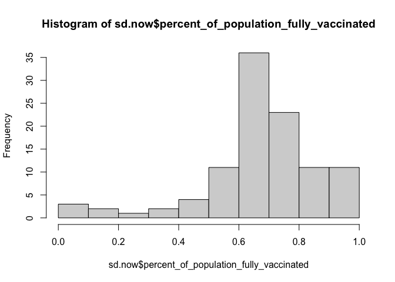
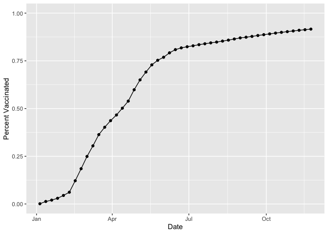
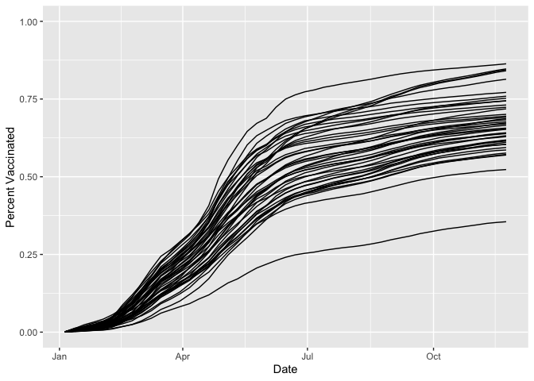
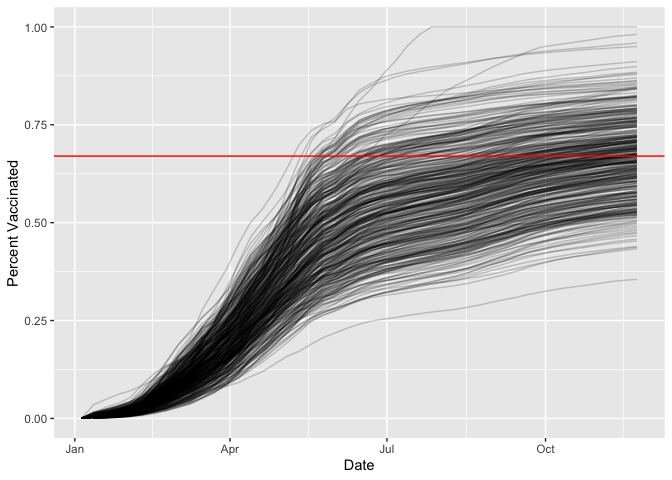

class17.Rmd
================
Sara Herrera (PID:A59011948)
11/24/2021

# COVID-19 Vaccination Rates

``` r
# Import vaccination data
vax <- read.csv("covid19vaccinesbyzipcode_test.csv")
head(vax)
```

    ##   as_of_date zip_code_tabulation_area local_health_jurisdiction         county
    ## 1 2021-01-05                    92395            San Bernardino San Bernardino
    ## 2 2021-01-05                    93206                      Kern           Kern
    ## 3 2021-01-05                    91006               Los Angeles    Los Angeles
    ## 4 2021-01-05                    91901                 San Diego      San Diego
    ## 5 2021-01-05                    92230                 Riverside      Riverside
    ## 6 2021-01-05                    92662                    Orange         Orange
    ##   vaccine_equity_metric_quartile                 vem_source
    ## 1                              1 Healthy Places Index Score
    ## 2                              1 Healthy Places Index Score
    ## 3                              3 Healthy Places Index Score
    ## 4                              3 Healthy Places Index Score
    ## 5                              1 Healthy Places Index Score
    ## 6                              4 Healthy Places Index Score
    ##   age12_plus_population age5_plus_population persons_fully_vaccinated
    ## 1               35915.3                40888                       NA
    ## 2                1237.5                 1521                       NA
    ## 3               28742.7                31347                       19
    ## 4               15549.8                16905                       12
    ## 5                2320.2                 2526                       NA
    ## 6                2349.5                 2397                       NA
    ##   persons_partially_vaccinated percent_of_population_fully_vaccinated
    ## 1                           NA                                     NA
    ## 2                           NA                                     NA
    ## 3                          873                               0.000606
    ## 4                          271                               0.000710
    ## 5                           NA                                     NA
    ## 6                           NA                                     NA
    ##   percent_of_population_partially_vaccinated
    ## 1                                         NA
    ## 2                                         NA
    ## 3                                   0.027850
    ## 4                                   0.016031
    ## 5                                         NA
    ## 6                                         NA
    ##   percent_of_population_with_1_plus_dose
    ## 1                                     NA
    ## 2                                     NA
    ## 3                               0.028456
    ## 4                               0.016741
    ## 5                                     NA
    ## 6                                     NA
    ##                                                                redacted
    ## 1 Information redacted in accordance with CA state privacy requirements
    ## 2 Information redacted in accordance with CA state privacy requirements
    ## 3                                                                    No
    ## 4                                                                    No
    ## 5 Information redacted in accordance with CA state privacy requirements
    ## 6 Information redacted in accordance with CA state privacy requirements

> How many entries do we have?

``` r
nrow(vax)
```

    ## [1] 82908

We can use the **skimr** package and the `skim()` function to get a
quick overview of the structure of the dataset:

``` r
skimr::skim(vax)
```

|                                                  |       |
|:-------------------------------------------------|:------|
| Name                                             | vax   |
| Number of rows                                   | 82908 |
| Number of columns                                | 14    |
| \_\_\_\_\_\_\_\_\_\_\_\_\_\_\_\_\_\_\_\_\_\_\_   |       |
| Column type frequency:                           |       |
| character                                        | 5     |
| numeric                                          | 9     |
| \_\_\_\_\_\_\_\_\_\_\_\_\_\_\_\_\_\_\_\_\_\_\_\_ |       |
| Group variables                                  | None  |

Data summary

**Variable type: character**

| skim\_variable              | n\_missing | complete\_rate | min | max | empty | n\_unique | whitespace |
|:----------------------------|-----------:|---------------:|----:|----:|------:|----------:|-----------:|
| as\_of\_date                |          0 |              1 |  10 |  10 |     0 |        47 |          0 |
| local\_health\_jurisdiction |          0 |              1 |   0 |  15 |   235 |        62 |          0 |
| county                      |          0 |              1 |   0 |  15 |   235 |        59 |          0 |
| vem\_source                 |          0 |              1 |  15 |  26 |     0 |         3 |          0 |
| redacted                    |          0 |              1 |   2 |  69 |     0 |         2 |          0 |

**Variable type: numeric**

| skim\_variable                                 | n\_missing | complete\_rate |     mean |       sd |    p0 |      p25 |      p50 |      p75 |     p100 | hist  |
|:-----------------------------------------------|-----------:|---------------:|---------:|---------:|------:|---------:|---------:|---------:|---------:|:------|
| zip\_code\_tabulation\_area                    |          0 |           1.00 | 93665.11 |  1817.39 | 90001 | 92257.75 | 93658.50 | 95380.50 |  97635.0 | ▃▅▅▇▁ |
| vaccine\_equity\_metric\_quartile              |       4089 |           0.95 |     2.44 |     1.11 |     1 |     1.00 |     2.00 |     3.00 |      4.0 | ▇▇▁▇▇ |
| age12\_plus\_population                        |          0 |           1.00 | 18895.04 | 18993.94 |     0 |  1346.95 | 13685.10 | 31756.12 |  88556.7 | ▇▃▂▁▁ |
| age5\_plus\_population                         |          0 |           1.00 | 20875.24 | 21106.04 |     0 |  1460.50 | 15364.00 | 34877.00 | 101902.0 | ▇▃▂▁▁ |
| persons\_fully\_vaccinated                     |       8355 |           0.90 |  9585.35 | 11609.12 |    11 |   516.00 |  4210.00 | 16095.00 |  71219.0 | ▇▂▁▁▁ |
| persons\_partially\_vaccinated                 |       8355 |           0.90 |  1894.87 |  2105.55 |    11 |   198.00 |  1269.00 |  2880.00 |  20159.0 | ▇▁▁▁▁ |
| percent\_of\_population\_fully\_vaccinated     |       8355 |           0.90 |     0.43 |     0.27 |     0 |     0.20 |     0.44 |     0.63 |      1.0 | ▇▆▇▆▂ |
| percent\_of\_population\_partially\_vaccinated |       8355 |           0.90 |     0.10 |     0.10 |     0 |     0.06 |     0.07 |     0.11 |      1.0 | ▇▁▁▁▁ |
| percent\_of\_population\_with\_1\_plus\_dose   |       8355 |           0.90 |     0.51 |     0.26 |     0 |     0.31 |     0.53 |     0.71 |      1.0 | ▅▅▇▇▃ |

We noticed that one of these columns is a date column. Working with time
and dates get’s annoying quickly, and there’s a package to help with
this called **lubridate**:

``` r
library(lubridate)
```

    ## 
    ## Attaching package: 'lubridate'

    ## The following objects are masked from 'package:base':
    ## 
    ##     date, intersect, setdiff, union

``` r
today()
```

    ## [1] "2021-12-03"

> How many days since the first entry in the dataset?

``` r
vax$as_of_date[1]
```

    ## [1] "2021-01-05"

We need to change the data column from character to numerical:

``` r
# today() - vax$as_of_date[1] won't work

d <- ymd(vax$as_of_date)
d[1]
```

    ## [1] "2021-01-05"

``` r
today() - d[1]
```

    ## Time difference of 332 days

I will make the `as_of_date` column Date format:

``` r
vax$as_of_date <- ymd(vax$as_of_date)
```

> When was the dataset last updated? What is the last date in this
> dataset? OR How many days since the last update?

``` r
today() - vax$as_of_date[ nrow(vax) ]
```

    ## Time difference of 10 days

> How many days does the dataset span?

``` r
vax$as_of_date[ nrow(vax) ] - vax$as_of_date[1]
```

    ## Time difference of 322 days

## Working with ZIP codes

> How many different Zip code areas are recorded in this dataset?

``` r
length(unique(vax$zip_code_tabulation_area))
```

    ## [1] 1764

To work with Zip codes we can use the **zipcodeR** package:

``` r
library(zipcodeR)
```

``` r
geocode_zip('92037')
```

    ## # A tibble: 1 × 3
    ##   zipcode   lat   lng
    ##   <chr>   <dbl> <dbl>
    ## 1 92037    32.8 -117.

``` r
zip_distance('92037','92109')
```

    ##   zipcode_a zipcode_b distance
    ## 1     92037     92109     2.33

``` r
reverse_zipcode(c('92037', "92109") )
```

    ## # A tibble: 2 × 24
    ##   zipcode zipcode_type major_city post_office_city common_city_list county state
    ##   <chr>   <chr>        <chr>      <chr>                      <blob> <chr>  <chr>
    ## 1 92037   Standard     La Jolla   La Jolla, CA           <raw 20 B> San D… CA   
    ## 2 92109   Standard     San Diego  San Diego, CA          <raw 21 B> San D… CA   
    ## # … with 17 more variables: lat <dbl>, lng <dbl>, timezone <chr>,
    ## #   radius_in_miles <dbl>, area_code_list <blob>, population <int>,
    ## #   population_density <dbl>, land_area_in_sqmi <dbl>,
    ## #   water_area_in_sqmi <dbl>, housing_units <int>,
    ## #   occupied_housing_units <int>, median_home_value <int>,
    ## #   median_household_income <int>, bounds_west <dbl>, bounds_east <dbl>,
    ## #   bounds_north <dbl>, bounds_south <dbl>

## Focus on the San Diego area

We want to subset the full CA `vax` data down to just San Diego county.
We can do it with base R:

``` r
# Subset to San Diego county only areas
inds <- vax$county == "San Diego"
nrow(vax[inds,])
```

    ## [1] 5029

But much better with the **dplyr** package to make things easier and
faster and be able to subset by:

``` r
library(dplyr)
```

    ## 
    ## Attaching package: 'dplyr'

    ## The following objects are masked from 'package:stats':
    ## 
    ##     filter, lag

    ## The following objects are masked from 'package:base':
    ## 
    ##     intersect, setdiff, setequal, union

``` r
# Use `filter()` function to do our subsetting:
sd <- filter(vax, county == "San Diego")
nrow(sd)
```

    ## [1] 5029

More complicated filtering:

``` r
sd.20 <- filter(vax, county == "San Diego" &
                age5_plus_population > 20000)
nrow(sd.20)
```

    ## [1] 3055

> What is the average vaccination rate of San Diego county as of the
> last updated date?

``` r
sd.now <- filter(vax, county == "San Diego" &
                as_of_date == "2021-11-23")
head(sd.now)
```

    ##   as_of_date zip_code_tabulation_area local_health_jurisdiction    county
    ## 1 2021-11-23                    92120                 San Diego San Diego
    ## 2 2021-11-23                    91962                 San Diego San Diego
    ## 3 2021-11-23                    92155                 San Diego San Diego
    ## 4 2021-11-23                    92147                 San Diego San Diego
    ## 5 2021-11-23                    91913                 San Diego San Diego
    ## 6 2021-11-23                    92114                 San Diego San Diego
    ##   vaccine_equity_metric_quartile                 vem_source
    ## 1                              4 Healthy Places Index Score
    ## 2                              3 Healthy Places Index Score
    ## 3                             NA            No VEM Assigned
    ## 4                             NA            No VEM Assigned
    ## 5                              3 Healthy Places Index Score
    ## 6                              2 Healthy Places Index Score
    ##   age12_plus_population age5_plus_population persons_fully_vaccinated
    ## 1               26372.9                28414                    21234
    ## 2                1758.7                 2020                      948
    ## 3                 456.0                  456                       70
    ## 4                 518.0                  518                       NA
    ## 5               43514.7                50461                    37974
    ## 6               59050.7                64945                    43708
    ##   persons_partially_vaccinated percent_of_population_fully_vaccinated
    ## 1                         3198                               0.747308
    ## 2                          126                               0.469307
    ## 3                           20                               0.153509
    ## 4                           NA                                     NA
    ## 5                         6690                               0.752542
    ## 6                         6261                               0.673000
    ##   percent_of_population_partially_vaccinated
    ## 1                                   0.112550
    ## 2                                   0.062376
    ## 3                                   0.043860
    ## 4                                         NA
    ## 5                                   0.132578
    ## 6                                   0.096405
    ##   percent_of_population_with_1_plus_dose
    ## 1                               0.859858
    ## 2                               0.531683
    ## 3                               0.197369
    ## 4                                     NA
    ## 5                               0.885120
    ## 6                               0.769405
    ##                                                                redacted
    ## 1                                                                    No
    ## 2                                                                    No
    ## 3                                                                    No
    ## 4 Information redacted in accordance with CA state privacy requirements
    ## 5                                                                    No
    ## 6                                                                    No

``` r
# `summary` function is a good way to get mean, median... fast
summary(sd.now$percent_of_population_fully_vaccinated)
```

    ##    Min. 1st Qu.  Median    Mean 3rd Qu.    Max.    NA's 
    ## 0.01017 0.61301 0.67965 0.67400 0.76932 1.00000       3

> Make a histogram of sd.now

Base R histogram:

``` r
hist(sd.now$percent_of_population_fully_vaccinated)
```

<!-- -->

This is going to be very susceptible to be skewed to small population
zip codes, where vaccinated or unvaccinated people will have a very big
effect on small numbers.

## Focus on UCSD/La Jolla

> What is the population of the 92037 Zip code?

Using Zip code 92037

``` r
lj <- filter(sd.now, zip_code_tabulation_area=="92037")
lj$age5_plus_population
```

    ## [1] 36144

> What is the average vaccination for this Zip code?

``` r
lj$percent_of_population_fully_vaccinated
```

    ## [1] 0.916196

> What about this Zip code 92122?

``` r
lj2 <- filter(sd.now, zip_code_tabulation_area=="92122")
lj2$age5_plus_population
```

    ## [1] 45951

``` r
lj2$percent_of_population_fully_vaccinated
```

    ## [1] 0.771474

> What about 91942?

``` r
lj3 <- filter(sd.now, zip_code_tabulation_area=="91942")
lj3$age5_plus_population
```

    ## [1] 37483

``` r
lj3$percent_of_population_fully_vaccinated
```

    ## [1] 0.683163

We’ll do a time series of vaccination rate for a given Zip code area: La
Jolla Start with 92037.

``` r
# We need to go back to full vax dataset, as the sd.now only has yesterday's date on it.

lajolla <- filter(vax, zip_code_tabulation_area=="92037")

library(ggplot2)

ggplot(lajolla) +
  aes(x=as_of_date,
      y=percent_of_population_fully_vaccinated) +
  geom_point() +
  geom_line(group=1) +
  ylim(c(0,1)) +
  labs(x="Date", y="Percent Vaccinated")
```

<!-- -->

## Comparing to similar sized areas

Let’s make this plot for all San Diego county areas with populations at
lease as large as the Zip code 92037.

``` r
sd.36 <- filter(vax, county=="San Diego", age5_plus_population > 36144)
head(sd.36)
```

    ##   as_of_date zip_code_tabulation_area local_health_jurisdiction    county
    ## 1 2021-01-05                    92058                 San Diego San Diego
    ## 2 2021-01-05                    92078                 San Diego San Diego
    ## 3 2021-01-05                    92019                 San Diego San Diego
    ## 4 2021-01-05                    92117                 San Diego San Diego
    ## 5 2021-01-05                    92057                 San Diego San Diego
    ## 6 2021-01-05                    91913                 San Diego San Diego
    ##   vaccine_equity_metric_quartile                 vem_source
    ## 1                              1 Healthy Places Index Score
    ## 2                              3 Healthy Places Index Score
    ## 3                              3 Healthy Places Index Score
    ## 4                              3 Healthy Places Index Score
    ## 5                              2 Healthy Places Index Score
    ## 6                              3 Healthy Places Index Score
    ##   age12_plus_population age5_plus_population persons_fully_vaccinated
    ## 1               34956.0                39695                       NA
    ## 2               41789.5                47476                       37
    ## 3               37439.4                40464                       25
    ## 4               50041.6                53839                       42
    ## 5               51927.0                56906                       22
    ## 6               43514.7                50461                       37
    ##   persons_partially_vaccinated percent_of_population_fully_vaccinated
    ## 1                           NA                                     NA
    ## 2                          688                               0.000779
    ## 3                          610                               0.000618
    ## 4                         1143                               0.000780
    ## 5                          691                               0.000387
    ## 6                         1993                               0.000733
    ##   percent_of_population_partially_vaccinated
    ## 1                                         NA
    ## 2                                   0.014492
    ## 3                                   0.015075
    ## 4                                   0.021230
    ## 5                                   0.012143
    ## 6                                   0.039496
    ##   percent_of_population_with_1_plus_dose
    ## 1                                     NA
    ## 2                               0.015271
    ## 3                               0.015693
    ## 4                               0.022010
    ## 5                               0.012530
    ## 6                               0.040229
    ##                                                                redacted
    ## 1 Information redacted in accordance with CA state privacy requirements
    ## 2                                                                    No
    ## 3                                                                    No
    ## 4                                                                    No
    ## 5                                                                    No
    ## 6                                                                    No

> How many Zip code areas in SD county have a population bigger than
> 92037?

``` r
length(unique(sd.36$zip_code_tabulation_area))
```

    ## [1] 43

Let’s make this plot with all the Zip codes:

``` r
ggplot(sd.36) +
  aes(x=as_of_date,
      y=percent_of_population_fully_vaccinated,
      group=zip_code_tabulation_area) +
  geom_line() +
  ylim(c(0,1)) +
  labs(x="Date", y="Percent Vaccinated")
```

    ## Warning: Removed 1 row(s) containing missing values (geom_path).

<!-- -->

> Make a plot for the whole state of CA for all Zip code areas with
> population at least as large as La Jolla

``` r
ca <- filter(vax, age5_plus_population > 36144)
```

How many Zip codes are we talking about?

``` r
length(unique(ca$zip_code_tabulation_area))
```

    ## [1] 411

``` r
ggplot(ca) +
  aes(x=as_of_date,
      y=percent_of_population_fully_vaccinated,
      group=zip_code_tabulation_area) +
  geom_line(alpha=0.2) +
  ylim(c(0,1)) +
  labs(x="Date", y="Percent Vaccinated") +
  geom_hline(yintercept = 0.67, color="red")
```

    ## Warning: Removed 176 row(s) containing missing values (geom_path).

<!-- -->

> What is the mean across the state for these 36k + population areas?

``` r
# The mean line was applied in the plot above.
ca.now <- filter(ca, as_of_date=="2021-11-23")
summary(ca.now$percent_of_population_fully_vaccinated)
```

    ##    Min. 1st Qu.  Median    Mean 3rd Qu.    Max. 
    ##  0.3552  0.5939  0.6696  0.6672  0.7338  1.0000

## About this document

``` r
sessionInfo()
```

    ## R version 4.1.1 (2021-08-10)
    ## Platform: x86_64-apple-darwin17.0 (64-bit)
    ## Running under: macOS Catalina 10.15.7
    ## 
    ## Matrix products: default
    ## BLAS:   /Library/Frameworks/R.framework/Versions/4.1/Resources/lib/libRblas.0.dylib
    ## LAPACK: /Library/Frameworks/R.framework/Versions/4.1/Resources/lib/libRlapack.dylib
    ## 
    ## locale:
    ## [1] en_US.UTF-8/en_US.UTF-8/en_US.UTF-8/C/en_US.UTF-8/en_US.UTF-8
    ## 
    ## attached base packages:
    ## [1] stats     graphics  grDevices utils     datasets  methods   base     
    ## 
    ## other attached packages:
    ## [1] ggplot2_3.3.5   dplyr_1.0.7     zipcodeR_0.3.3  lubridate_1.8.0
    ## 
    ## loaded via a namespace (and not attached):
    ##  [1] httr_1.4.2         tidyr_1.1.4        bit64_4.0.5        jsonlite_1.7.2    
    ##  [5] sp_1.4-5           highr_0.9          blob_1.2.2         yaml_2.2.1        
    ##  [9] tidycensus_1.1     pillar_1.6.3       RSQLite_2.2.8      lattice_0.20-44   
    ## [13] glue_1.4.2         uuid_1.0-3         digest_0.6.28      rvest_1.0.2       
    ## [17] colorspace_2.0-2   htmltools_0.5.2    pkgconfig_2.0.3    raster_3.5-2      
    ## [21] purrr_0.3.4        scales_1.1.1       terra_1.4-11       tzdb_0.2.0        
    ## [25] tigris_1.5         tibble_3.1.5       proxy_0.4-26       farver_2.1.0      
    ## [29] generics_0.1.0     ellipsis_0.3.2     withr_2.4.2        cachem_1.0.6      
    ## [33] repr_1.1.3         skimr_2.1.3        cli_3.1.0          magrittr_2.0.1    
    ## [37] crayon_1.4.1       memoise_2.0.0      maptools_1.1-2     evaluate_0.14     
    ## [41] fansi_0.5.0        xml2_1.3.2         foreign_0.8-81     class_7.3-19      
    ## [45] tools_4.1.1        hms_1.1.1          lifecycle_1.0.1    stringr_1.4.0     
    ## [49] munsell_0.5.0      compiler_4.1.1     e1071_1.7-9        rlang_0.4.11      
    ## [53] classInt_0.4-3     units_0.7-2        grid_4.1.1         rstudioapi_0.13   
    ## [57] rappdirs_0.3.3     labeling_0.4.2     base64enc_0.1-3    rmarkdown_2.11    
    ## [61] gtable_0.3.0       codetools_0.2-18   DBI_1.1.1          curl_4.3.2        
    ## [65] R6_2.5.1           knitr_1.36         rgdal_1.5-27       fastmap_1.1.0     
    ## [69] bit_4.0.4          utf8_1.2.2         KernSmooth_2.23-20 readr_2.0.2       
    ## [73] stringi_1.7.5      Rcpp_1.0.7         vctrs_0.3.8        sf_1.0-4          
    ## [77] tidyselect_1.1.1   xfun_0.26
